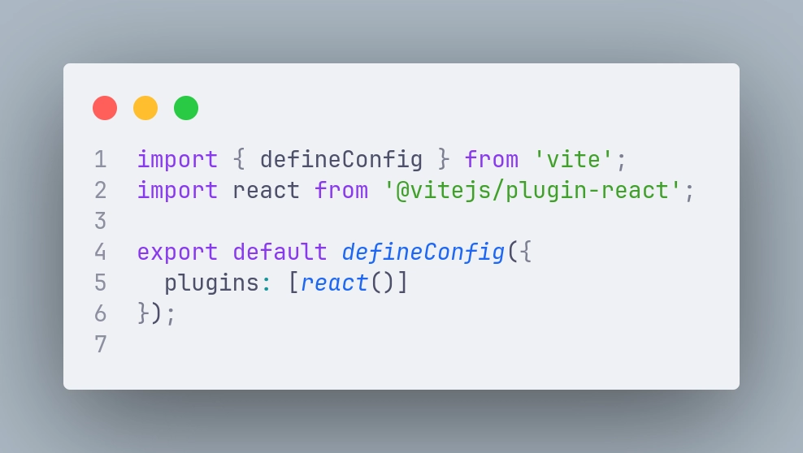

Dans le cadre de mon travail, j’ai eu l’occasion de faire plusieurs montées de version d’application, pour lesquels j’ai poussé la mise en place de Vite. Ces projets utilisaient initialement pour l’un, une configuration Webpack CRA vanilla le projet A et pour le projet B une configuration Webpack custom avec plusieurs plugins.

Je vais vous parler de mon retour d’expérience sur sa mise en place et de ses avantages afin que vous puissiez avoir toutes les informations nécessaires pour potentiellement vouloir passer à Vite.

## Mise en place de Vite

J’ai voulu mettre en place Vite sur le projet A car celui-ci avait beaucoup de lourdeur lors de son développement, notamment un hot reload très lent car il a une librairie conséquente en monorepo qui devait se recharger à chaque nouvelle modification.

En suivant simplement un tutoriel d’un passage de CRA à Vite avec le retrait notamment de react-scripts voici la configuration avec laquelle on se retrouve :

---

---

Et c’est tout. Il faudra adapter certains éléments supplémentaires que vous trouverez facilement sur des documentations mais ce n’est pas grand chose. Ce remplacement m’a pris 2H pour tout le monorepo, donc ça va vite.

Pour le second projet, on m’avait demandé de ne pas mettre Vite, mais de mettre à jour les plugins Webpack dans le cadre d’un maintien de l’application. Je me suis arraché les cheveux.

Ce projet avait vraiment beaucoup plugins. Pour la plupart, c’était un vrai casse tête, bibliothèque plus maintenue, remplacée par un tel qui lui aussi est remplacée par une autre puis finalement plus compatible parce que ci…

    

Bref… c’était peine perdu. Puis, j’ai forcé la chose avec Vite et… magie ! Configuration tout aussi simple que le premier projet et tout fonctionne ! Vite prends en charge tellement de bibliothèques désormais beaucoup utilisé que ça y va tout seul. Grâce à ça nous avons fait un tri gigantesque avec la suppression de 21 packages uniquement en lien avec de la configuration de projet.

Toutefois, ce projet avait besoin d’une configuration supplémentaire dans le `vite.config`. Leur site ayant une documentation très claire, il m'a été facile d'adapter et de régler cette configuration.

## Confort de développement

Pour parler un peu globalement, je trouve que Vite bien plus agréable à développer avec. Comme dis plus haut, la configuration est simple, leur documentation aussi, la communauté évolue super vite, le hot reload très efficace, la console bien plus explicite et ses raccourcis d’input avec notamment le reload ou le shutdown. Puis je pense que vous trouverez des aspects tout aussi intéressants, je ne fais qu’effleurer la couche haute de l’iceberg.

Pour le projet A notamment, plus d’attente sur le hot reload de 5-6 secondes à chaque sauvegarde qui pouvait se produire dans notre librairie de composant. C’est plus agréable de bosser dessus et on gagne beaucoup de temps à ne pas avoir peur de sauvegarder afin d’éviter le temps d’attente interminable lorsqu’on change qu’un malheureux petit caractère par exemple.

Le projet B a aussi un bon coup de boost pour son hot reload qui est désormais instantané.

En plus d’avoir fait un gros ménage au niveau des packages, les deux projets ont eu une configuration beaucoup plus légère et compréhensible, la documentation est très bien expliqué. On s’y retrouve simplement.

## Le build

Pour ce qui est du build, c’est le jour et la nuit.

Pour le projet A, 5min30 en moyenne de build avec la configuration CRA vanilla, avec le passage à Vite 40 secondes de build en moyenne. Nous avons obtenu quasiment 5 minutes de différence. Cela contribue grandement à la réduction du temps d’une CI et donc on a plus tendance à livrer en serveur de test. Ça évite de se retrouver noyé par les features à tester d’un coup.

En plus d’une grosse réduction du temps de build, nous avons aussi un bundle.js bien plus petit et mieux optimisé, nous avons gagné 2Mib dans la taille du bundle ! Alors, certes le projet n’est initialement pas hyper bien optimisé, mais juste un passage de bundle montre que Vite, arrive à optimiser pleins d’aspects différents.

Pour le projet B avec sa config Webpack customisé, nous obtenons des résultats similaire sur le temps de build, de 4 minutes à 30 secondes, et 4 Mib de gagné.

## Conclusion

Pour moi, je ne vois plus d’avantage de rester sur Webpack, l’entretien des plugins et des nombreux packages sont trop contraignants. Même si votre projet fonctionne correctement, Vite est bien meilleur sur de nombreux aspects. Vous gagnerez du temps et des performances à tous les niveaux et notamment sur le maintien à jour des packages de votre application.